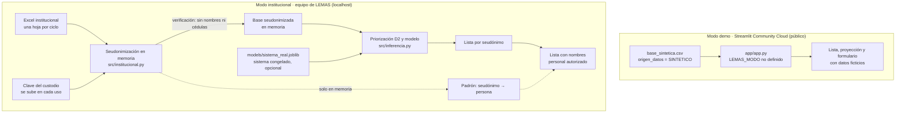

# Arquitectura del sistema

Este documento describe cómo está construido el sistema: el flujo de datos, los componentes de código, la solución elegida, el diseño de la aplicación en dos modos y los controles de privacidad. Las decisiones citadas como **Dnn** están registradas en [`planificacion.md`](planificacion.md).

## 1. Visión general

El sistema responde a una pregunta operativa. Al **20 de febrero** (t0), entre las familias con reserva aprobada, ¿a quiénes conviene contactar primero porque podrían **no pagar la matrícula** hasta el **30 de abril** (H)?

```mermaid
flowchart LR
    A[Excel institucional<br/>una hoja por ciclo] -->|00a · seudonimización<br/>HMAC-SHA256 + clave del custodio| B[base_seud.csv<br/>sin cédulas ni nombres]
    B --> C[Limpieza y reglas del estudio<br/>src/data_processing.py]
    C --> D[Cohortes C1–C5<br/>etiqueta y_no_matricula]
    D --> E[Auditoría<br/>eventos, comparabilidad C1]
    E --> F[Modelado y selección<br/>src/modeling.py]
    F --> G[Prueba única C5<br/>IC bootstrap, equidad]
    G --> H[Solución final<br/>regla D2 + modelo calibrado]
    H --> I[Aplicación Streamlit<br/>src/inferencia.py + app/app.py]
```

## 2. Componentes de código

| Módulo | Responsabilidad |
|---|---|
| `config.yaml` | Todas las reglas del estudio: cohortes, t0 y H, filtros de elegibilidad, alias de columnas, capacidad k, privacidad y figuras. El código no tiene fechas ni umbrales escritos a mano |
| `tools/seudonimizar.py` | Seudonimización con HMAC-SHA256 (cédula del estudiante y del representante), derivación del año de ingreso, acta con huella SHA-256 y reidentificación por el custodio. Sus funciones trabajan en memoria y las usan el cuaderno 00a, la línea de comandos y la aplicación |
| `tools/generar_excel_ejemplo.py` | Excel y clave **ficticios** con la estructura institucional, para capacitación y pruebas |
| `src/data_processing.py` | Limpieza, normalización (curso, estados de reserva, alias), representantes atípicos, predictores conocidos en t0, cohortes, etiqueta y guardas anti-fuga |
| `src/auditoria.py` | Conteo de eventos, EPV, diferencias estandarizadas, decisión sobre C1, tabla 6.3 del v5 y sensibilidad |
| `src/evaluate.py` | Consolidación por representante, k por sede y Precision/Recall/Lift@k familiar |
| `src/modeling.py` | Candidatos, optimización con Optuna, selección en C4, calibración, congelamiento, bootstrap, líneas base R/B0/B1, equidad y proyección |
| `src/diagnostico.py` · `src/graficos_diagnostico.py` | Actividad de la semana 3: seguimiento de métricas por iteración, curvas de aprendizaje de scikit-learn, diagnóstico cuantitativo de sobreajuste y subajuste, estrategias con antes/después y sus figuras |
| `src/alcance.py` · `src/graficos_alcance.py` | Análisis descriptivo del alcance de la lista (D50): desglose del evento, alcance según k y lista semanal frente a lista fija. No usa C5 ni cambia el sistema |
| `src/inferencia.py` | Lógica de la aplicación (validación, población del ciclo, puntuación, lista, proyección y formulario), separada de Streamlit para poder probarla |
| `src/institucional.py` | Modo institucional (D45): seudonimiza el Excel en memoria, verifica que no queden identificadores, arma el acta y construye la lista con nombres. Comprueba que la app se use en el mismo equipo |
| `src/synthetic.py` | Generador de datos sintéticos con la estructura real, calibrado con totales agregados |
| `app/app.py` | Interfaz Streamlit |
| `notebooks/` | Flujo reproducible en Colab: 00a → 00b → 01 → 02 → 03 |
| `tests/` | 175 pruebas: reglas del estudio, métricas, modelado, diagnóstico de ajuste, alcance de la lista, protocolo (C5 nunca se usa al ajustar), interfaz y modo institucional |
| `iniciar_lemas.bat` / `.sh` | Arranque con doble clic del modo institucional, limitado a `localhost` |

## 3. Solución elegida

### 3.1 Protocolo temporal
| Rol | Cohorte (ciclo de origen → destino) |
|---|---|
| Entrenamiento | C2 (2022→2023) + C3 (2023→2024). C1 excluida por la auditoría (D14, decisión del 01-oct) |
| Optimización interna | C2 → C3 |
| Selección y calibración | C4 (2024→2025) |
| Prueba final, una sola vez | C5 (2025→2026, matrícula 2026–2027) |

### 3.2 Candidatos evaluados
| Candidato | Tipo | Lift@k en C4 | Resultado |
|---|---|---|---|
| **D2 · señales administrativas** | Regla: pago anterior tardío → reserva extraordinaria → atrasos | **1,93** | **Elegido para priorizar (D40)** |
| D · más atrasos primero | Regla | 1,86 | Referencia |
| Logística híbrida | Regresión logística con señales de D2 + variables académicas | 1,53 | Se usa para probabilidades y proyección |
| Regresión logística regularizada | Elastic-net | 1,40 | Descartada |
| Gradient boosting | HistGradientBoosting, monotonía en atrasos | 1,06 | Descartada (sobreajuste) |

### 3.3 Arquitectura de la solución final
1. **Priorización:** regla **D2**, transparente y validada en C5 (Lift@k = 1,97 [1,24; 2,56]). Cada familia ocupa un solo cupo de contacto. Los empates dentro del mismo puntaje D2 se resuelven al azar con semilla fija, con la misma función en la validación y en la aplicación (`evaluate.primeras_k`, D48). La probabilidad del modelo no interviene en el orden.
2. **Probabilidad individual:** logística híbrida calibrada con Platt en C4. Está bien calibrada, pero no mejora a B1 (Brier 0,0648 frente a 0,0647), por eso la interfaz la presenta junto a la tasa histórica y solo en el formulario individual: las listas de contacto no la muestran (D49).
3. **Proyección por sede y subnivel:** suma de probabilidades de matrícula, comparada siempre con B1 (MAPE de 2,8 % en ambos casos).
4. **Capacidad:** k = 2 × el promedio histórico de familias con no matrícula (D32): 118 en Mucho Lote 1 y 47 en Mucho Lote 2.
5. **Seguimiento (D51):** a una fecha de corte entre el 20 de febrero y el 30 de abril, lista a todas las familias de la población inicial que no registran el pago de la matrícula hasta ese día (`inferencia.seguimiento_al_corte`). No usa el modelo ni aplica k: es un listado para la segunda etapa propuesta en [alcance_lista.md](alcance_lista.md), que aún no se ha validado.

## 4. Aplicación en dos modos (D42 y D45)

Diseño aprobado el 01-oct-2026: **los datos reales nunca llegan a un servidor público.** Desde D45, el modo institucional cubre el ciclo completo dentro de LEMAS (Excel → lista priorizada → lista con nombres), sin Colab ni línea de comandos.

| Aspecto | Modo demo | Modo institucional |
|---|---|---|
| Dónde corre | Streamlit Community Cloud | Un computador de LEMAS (`localhost`) |
| Cómo se activa | Por defecto | `iniciar_lemas.bat`, que fija `LEMAS_MODO=institucional` y limita el servidor a `127.0.0.1` |
| Datos aceptados | Solo sintéticos (`origen_datos = SINTETICO`) | Excel institucional + clave del custodio (se seudonimiza en el equipo), o `base_seud.csv` ya seudonimizado |
| Seudonimización | No aplica | En memoria, con la misma técnica del cuaderno 00a; los seudónimos coinciden |
| Nombres en pantalla | Nunca | Solo en las pestañas *Lista con nombres* y *Seguimiento*, tras confirmar que se es personal autorizado |
| Sistema de predicción | Se reentrena con la base sintética (mismo protocolo y mismos hiperparámetros) | `models/sistema_real.joblib` congelado en la Fase 2; si no está, se reentrena con la base cargada |
| Salida | Lista ficticia | Lista por seudónimo y, para personal autorizado, lista con nombres |

**Controles implementados en `src/inferencia.py` (ambos modos):**
- El modelo y la priorización reciben **solo la base seudonimizada**. Un CSV con columnas de identificadores directos (cédula, nombres, código interno, teléfono, correo, dirección) se rechaza.
- En modo demo se rechaza todo archivo que no lleve la marca de datos sintéticos (`origen_datos = SINTETICO`). Es una barrera contra errores, no contra un uso deliberado.
- Procesa en memoria: no escribe en disco ni envía datos a terceros.
- Muestra mensajes de error en lenguaje simple, sin detalles técnicos.

**Recarga del código (`app/app.py`, ambos modos, D51):** en cada ejecución, `app.py` compara la fecha de los archivos de `src/` y `tools/` con la de los módulos en memoria. Si cambió alguno, los descarta junto con las cachés y los importa de nuevo. Evita que, tras actualizar el repositorio, la aplicación combine `app.py` nuevo con `src/` viejo.

**Controles del modo institucional (`src/institucional.py` y `app/app.py`, D45):**
- El cargador de Excel, la clave y la pestaña con nombres **no existen** en el modo demo.
- Solo funcionan si la app se abre en el mismo equipo (`localhost`). El arranque limita el servidor a `127.0.0.1`, así que otros equipos de la red no pueden conectarse; la app además comprueba la dirección con la que se abrió.
- Después de seudonimizar se verifica que no quede ninguna columna con nombres ni cédulas válidas; si queda alguna, el proceso se detiene. También se eliminan columnas no previstas que parezcan identificadores (teléfono, correo, dirección).
- La clave se sube en cada uso y no se guarda. La app muestra una **huella de la clave** (SHA-256 truncado, no reversible) para comprobar que es la misma de siempre.
- El padrón (seudónimo → persona) vive solo en la memoria de la sesión. El botón **Borrar datos de la sesión** descarta el Excel, la clave, el padrón y los resultados.
- Los nombres se muestran solo tras una confirmación explícita, con un aviso de uso interno.

**Límite conocido:** la comprobación de `localhost` se basa en la dirección que envía el navegador, así que es una ayuda para el usuario y no una barrera por sí sola. La protección real es que el arranque solo escucha en `127.0.0.1`. Si alguien inicia la app a mano sin esa opción, queda expuesta a la red local.

## 5. Ciclo operativo anual (modo institucional)

| Fecha | Paso | Responsable |
|---|---|---|
| Septiembre–enero | Reservas y su aprobación | Secretaría |
| Hasta el 19 de febrero | Exportar el Excel institucional (una hoja por ciclo) | Responsable de datos |
| 20 de febrero (t0) | Abrir la app con `iniciar_lemas.bat`, subir el Excel y la clave, y generar la lista por sede | Admisiones, con el custodio |
| 20 de febrero | Obtener la lista con nombres en la app y borrar los datos de la sesión | Custodio |
| 20-feb a 30-abr | Contacto de apoyo (planes de pago, información, inquietudes) | Secretaría |
| Hacia el 20 a 27 de marzo (propuesta para 2027) | Exportar de nuevo el Excel y listar en *Seguimiento* a las familias que siguen sin pagar | Admisiones, con el custodio |
| Mayo | Comparar la lista con las matrículas reales y actualizar el historial | Datos + Dirección |

## 6. Reproducibilidad y calidad
- **Semilla única** (42) en datos sintéticos, Optuna, bootstrap y desempates.
- **Configuración central** en `config.yaml` y registro de decisiones D01–D51.
- **Versiones exactas** en `requirements-lock.txt` y en `app/requirements.txt`.
- **Integración continua** (GitHub Actions): ruff (PEP 8) y pytest en cada push.
- **Sistema congelado** con huella SHA-256 registrada antes de abrir C5.
- **Cuadernos listos para Colab**, que se pueden ejecutar de punta a punta con la base sintética. Siguen siendo la evidencia académica del proceso; el uso anual en LEMAS ya no los necesita.

## 7. Tecnologías
Python 3.11+, pandas, NumPy, scikit-learn, Optuna, SHAP, Matplotlib/Seaborn, Plotly, Streamlit, openpyxl, pytest, ruff y GitHub Actions.
