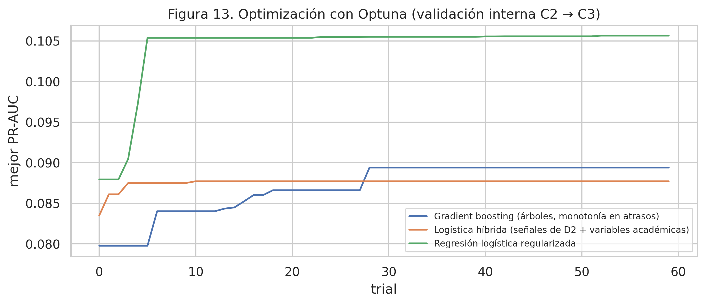

# Optimización de hiperparámetros (Workshop S5)

Este documento explica cómo se optimizaron los modelos, qué se obtuvo y qué se aprendió. Las cifras salen de la ejecución con datos reales del cuaderno `03_modelado` (01-oct-2026). El código está en `src/modeling.py`.

## 1. Diseño de la optimización

| Elemento | Decisión | Justificación |
|---|---|---|
| Herramienta | **Optuna 5**, muestreador TPE con semilla 42 | Búsqueda bayesiana eficiente y reproducible |
| Validación interna | Entrenar con **C2** y validar con **C3** | Respeta el orden temporal: el modelo nunca ve el futuro. C4 y C5 quedan fuera de la búsqueda |
| Función objetivo | **PR-AUC** (precisión promedio) en C3 | Con alrededor de 80 eventos por cohorte, Precision@k es muy ruidosa como objetivo. La PR-AUC resume el orden completo y es estable |
| Presupuesto | 60 trials por modelo (180 en total) | La mejor PR-AUC se estabiliza antes del trial 30 en los tres modelos (Figura 13) |
| Selección final | **Lift@k en C4** (desempate: PR-AUC), frente a las reglas D y D2 | La métrica principal del proyecto se mide en datos que no participaron en la búsqueda |
| Reentrenamiento | El mejor conjunto de hiperparámetros se reentrena con C2+C3 | Usa todos los datos de entrenamiento disponibles |

### Espacios de búsqueda
| Modelo | Hiperparámetros |
|---|---|
| Regresión logística (elastic-net, solver saga) | `C` ∈ [0,001; 10] (escala log), `l1_ratio` ∈ [0; 1], balanceo de clases (sí/no), conjunto de variables (completo / sin `curso`) |
| Gradient boosting (HistGradientBoosting, monotonía creciente en atrasos) | `learning_rate` ∈ [0,01; 0,2] (log), `max_depth` ∈ {2, 3, 4}, `max_leaf_nodes` ∈ [4; 15], `min_samples_leaf` ∈ [20; 120], `l2_regularization` ∈ [0,001; 10] (log), `max_iter` ∈ [50; 400], balanceo y conjunto de variables |
| Logística híbrida (D39, intento único) | `C` ∈ [0,001; 10] (log) y balanceo. Las variables son fijas: señales de D2 más variables académicas |

Los rangos son **conservadores a propósito**: árboles poco profundos, hojas grandes y regularización fuerte, porque hay pocos eventos (193 en el entrenamiento).

## 2. Resultados

### Hiperparámetros elegidos (datos reales)
| Modelo | Mejores hiperparámetros |
|---|---|
| Regresión logística | todas las variables, sin balanceo, `C` = 2,75, `l1_ratio` = 0,87 |
| Gradient boosting | todas las variables, con balanceo, `learning_rate` = 0,035, `max_depth` = 3, `max_leaf_nodes` = 6, `min_samples_leaf` = 101, `l2` = 4,25, `max_iter` = 359 |
| Logística híbrida | con balanceo, `C` = 9,0 |

### Efecto de la optimización en C4 (métrica principal)
| Modelo | Antes de optimizar | Después de optimizar | Diagnóstico |
|---|---|---|---|
| Regresión logística | **1,53** (base de la Fase 1, valores por defecto) | 1,40 | Subajuste: PR-AUC 0,140 en entrenamiento y 0,113 en C4 |
| Gradient boosting | — | 1,06 | **Sobreajuste:** PR-AUC 0,245 en entrenamiento y 0,104 en C4 (brecha 0,14) |
| Logística híbrida | — | 1,53 | Estable: brecha 0,000 |
| *Referencia: regla D2* | — | *1,93* | — |

### Evolución de la búsqueda (validación interna C2 → C3, datos reales)

| Modelo | PR-AUC mínima | Mediana | Máxima (trial) | Llega cerca del máximo en |
|---|---|---|---|---|
| Regresión logística | 0,062 | 0,102 | **0,106** (52) | trial 5 |
| Gradient boosting | 0,067 | 0,084 | 0,089 (28) | trial 28 |
| Logística híbrida | 0,084 | 0,087 | 0,088 (10) | trial 3 |

*Referencia: la tasa de no matrícula de C3 es 0,062, que es la PR-AUC de un modelo sin capacidad de ordenar.*

**Lectura:**
- **La regresión logística** fue la que más mejoró con la búsqueda, de 0,062 a 0,106. Sus valores mínimos (0,062) corresponden a regularización muy fuerte (`C` < 0,02), que reduce el modelo a la tasa base. Los mejores trials usan poca regularización, mezcla L1/L2 alta, todas las variables y **sin balanceo** (mediana 0,102 frente a 0,095 con balanceo).
- **El gradient boosting** necesitó más trials (mejor en el 28) y prefiere hojas grandes (`min_samples_leaf` ≈ 100) y el conjunto completo (mediana 0,084 frente a 0,077 sin `curso`). Aun su mejor valor queda por debajo de la logística.
- **La logística híbrida** casi no cambia con `C` (0,084 a 0,088): sus variables son fijas y pocas. El balanceo ayuda (0,087 frente a 0,084).
- **El orden de los modelos cambió de C3 a C4:** en la validación interna ganó la logística regularizada (0,106), pero en C4 fue mejor la híbrida (Lift@k 1,53 frente a 1,40). Esta inestabilidad entre cohortes es la razón principal para seleccionar en una cohorte distinta (C4) y no confiar solo en la búsqueda.

Las figuras 14 a 16 del cuaderno `04_optimizacion` muestran cada trial, el efecto de `C`, del balanceo y del tamaño de hoja, y el paso de C3 a C4.

Archivo completo de los 180 trials: `results/metrics/optuna_historial_real.csv`. Contiene hiperparámetros y PR-AUC, sin datos de estudiantes.

## 3. Análisis: ¿por qué la optimización no mejoró la priorización?

1. **La señal es débil y cambia entre años.** La tasa de no matrícula varía de 6,2 % a 11,1 % según la cohorte, y las correlaciones univariadas son menores a 0,07. Lo que funcionó mejor en C3, que solo tiene 81 eventos, no se trasladó a C4. Optimizar sobre una sola cohorte pequeña ajusta parte del ruido.
2. **El modelo de árboles memoriza.** Aun con restricciones fuertes y monotonía, duplica su PR-AUC en entrenamiento sin ganar nada en C4: es el patrón típico de **sobreajuste** visto en la actividad de la semana 3.
3. **Los modelos lineales se quedan cortos.** Tienen brecha pequeña pero rendimiento bajo en entrenamiento: **subajuste**, causado por la falta de información en los datos y no por falta de capacidad del modelo.
4. **La regla D2 incorpora conocimiento del dominio.** Ordena por jerarquía: un pago anterior tardío pesa más que cualquier número de atrasos. Ese orden lexicográfico no lo aprendió un modelo entrenado con pocos eventos.

## 4. Mejoras que sí aportó el proceso

- **Se evitó un sobreajuste no detectado.** Sin la comparación con C4, el gradient boosting habría parecido el mejor modelo por su desempeño en entrenamiento.
- **Se ganó calibración.** La logística, con Platt en C4, entrega probabilidades confiables (Brier 0,0648, igual a la tasa histórica), mientras que el modelo sin calibrar tenía un Brier de 0,22.
- **Las decisiones quedaron registradas.** Se probó un solo intento adicional, registrado antes de verlo (D39). Así se evitó probar variantes hasta que alguna gane por azar sobre C4.
- **Se confirmó la regla fuera de muestra.** En C5, D2 obtuvo Lift@k = 1,97 [1,24; 2,56], y el mejor modelo, 0,98.

## 5. Trabajo futuro
- **Validación cruzada temporal con más cohortes** (2027 en adelante): con cada ciclo nuevo habrá más eventos para optimizar con menos ruido.
- **Variables nuevas** con más señal: interacción con Secretaría, puntualidad mes a mes y motivos de no matrícula (con consentimiento).
- **Optimizar directamente Lift@k** con varias ventanas temporales cuando haya al menos 3 cohortes de validación.
